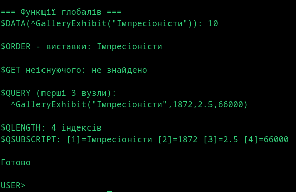

# Лабораторна 2: Глобали та списки

Предметна область: Галерея/Музей

Програма на ObjectScript демонструє роботу з ієрархічними даними через глобали IRIS. Дані про експонати виставок зберігаються у деревоподібній структурі з чотирма рівнями індексів.

## Структура глобала

```
^GalleryExhibit(exhibitionName, creationYear, estimatedValue, exhibitDate) = value
```

Кожен рівень індексу має свій тип даних:
- `exhibitionName` — рядок (назва виставки)
- `creationYear` — ціле число (рік створення твору)
- `estimatedValue` — дробове число (оціночна вартість у мільйонах)
- `exhibitDate` — дата у форматі $HOROLOG

Така структура дозволяє швидко знаходити експонати за будь-яким критерієм через `$ORDER`.

## Два види списків

Значення вузла містить комбінацію двох форматів зберігання списків:

**Рядковий список** — елементи з'єднані через роздільник `|`. Простий формат, зручний для читання людиною. Парсинг через `$PIECE(value, "|", position)`.

**Системний список** — створений через `$ListBuild()`. Компактніший у пам'яті, підтримує елементи різних типів. Доступ через `$LISTGET(list, position)`.

## Функції роботи з глобалами

- `$DATA()` — перевірка існування вузла (повертає 0, 1, 10 або 11)
- `$ORDER()` — отримання наступного індексу на поточному рівні
- `$GET()` — безпечне читання з default-значенням якщо вузол не існує
- `$QUERY()` — повний обхід дерева глобала
- `$QLENGTH()` — кількість індексів у поточному посиланні
- `$QSUBSCRIPT()` — значення індексу за його позицією

Всі дані вводяться користувачем через `Read`, що дозволяє тестувати з різними значеннями.



