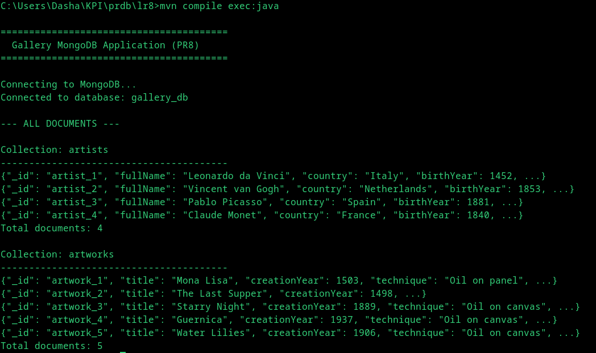
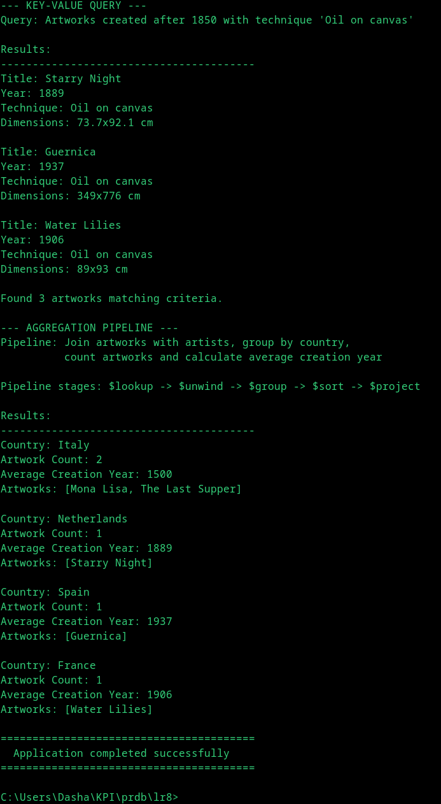

# Лабораторна 8: MongoDB

Предметна область: Галерея/Музей

База `gallery_db` з трьома колекціями відповідно до UML-діаграми з ПР3. Java-програма демонструє вивід документів, запит з умовами та агрегаційний конвеєр.

## Моделі даних

**Normalized (посилання)** — відношення one-many між Artist та Artwork реалізовано через `artistId`. Кожен твір зберігає ObjectId художника, дані художника отримуються окремим запитом або через `$lookup`.

```json
// artworks collection
{ "title": "Мона Ліза", "artistId": ObjectId("..."), "creationYear": 1503 }
```

**Embedded (вбудовування)** — відношення parent-children між Exhibition та Exhibit реалізовано вбудовуванням. Експонати зберігаються як масив всередині виставки. Location також вбудований в Exhibition.

```json
// exhibitions collection
{
  "title": "Майстри Відродження",
  "location": { "building": "Головний", "hall": "Зал А", "floor": 2 },
  "exhibits": [
    { "position": 1, "artworkId": ObjectId("..."), "tags": ["шедевр"] }
  ]
}
```



## Java-програма

MongoDB Java Driver (mongodb-driver-sync 4.11.1). Клас `GalleryMongoApp` виконує три операції.

**Вивід всіх документів** — ітерація по колекціях artists, artworks, exhibitions через `collection.find().iterator()`.

**Запит з умовами** — вибірка творів олійною технікою після 1850 року:

```java
Filters.and(
    Filters.gt("creationYear", 1850),
    Filters.eq("technique", "Oil on canvas")
)
```

**Агрегаційний конвеєр** для статистики творів по країнах художників. П'ять етапів: спочатку `$lookup` з'єднує artworks з artists по artistId, потім `$unwind` розгортає масив у окремі документи, `$group` групує по country і рахує твори та середній рік, `$sort` сортує за кількістю, і нарешті `$project` форматує вивід.

```java
Aggregates.lookup("artists", "artistId", "_id", "artistInfo"),
Aggregates.unwind("$artistInfo"),
Aggregates.group("$artistInfo.country",
    Accumulators.sum("artworkCount", 1),
    Accumulators.avg("averageCreationYear", "$creationYear")),
Aggregates.sort(Sorts.descending("artworkCount")),
Aggregates.project(...)
```


