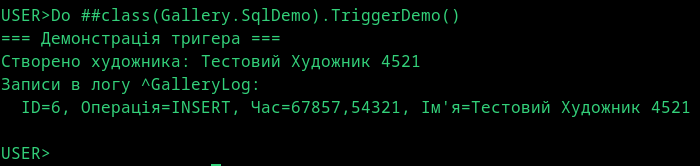

# Лабораторна 6: SQL-запити та тригери

Предметна область: Галерея/Музей

Демонстрація різних способів виконання SQL-запитів в IRIS: динамічний SQL через %SQL.Statement, вбудований SQL з курсорами, COS-based Query для складних випадків. Тригер логує зміни в окремий глобал.

## Dynamic SQL з Implicit Join

Запит через `%SQL.Statement` з параметром — вибірка творів починаючи з певного року. Параметри передаються в `%Execute()`, що захищає від SQL-ін'єкцій.

```sql
SELECT Title, CreationYear, Artist->FullName
FROM Gallery.Artwork
WHERE CreationYear >= ?
ORDER BY CreationYear
```

Оператор `->` (implicit join) замінює явний JOIN — `Artist->FullName` автоматично переходить по посиланню. Працює на будь-яку глибину вкладеності: `Exhibit->Artwork->Artist->FullName`.


## Embedded SQL

**Простий запит** — отримання одного значення через `&sql(SELECT ... INTO :var)`. Результат потрапляє у локальну змінну, SQLCODE показує статус виконання.

```objectscript
&sql(SELECT FullName INTO :artistName FROM Gallery.Artist WHERE %ID = 1)
```

**Курсор** — покрокова обробка результатів для великих вибірок. Послідовність: DECLARE → OPEN → FETCH у циклі → CLOSE. Кожен FETCH повертає один рядок.

```objectscript
&sql(DECLARE artCursor CURSOR FOR SELECT Title, Artist->FullName FROM Gallery.Artwork)
&sql(OPEN artCursor)
For {
    &sql(FETCH artCursor INTO :title, :artist)
    Quit:SQLCODE'=0
    Write title, " - ", artist, !
}
&sql(CLOSE artCursor)
```


## COS-based Query

Метод-запит `Gallery.Exhibition:GetExhibitionsByDateRange` з двома параметрами (початок та кінець діапазону). На відміну від SQL, логіка реалізована в ObjectScript — корисно для складних умов, які важко виразити в SQL.

```objectscript
Query GetExhibitionsByDateRange(startFrom, endTo) As %Query
{
    ...
}
ClassMethod GetExhibitionsByDateRangeExecute(...) { ... }
ClassMethod GetExhibitionsByDateRangeFetch(...) { ... }
ClassMethod GetExhibitionsByDateRangeClose(...) { ... }
```

## Тригер

`LogArtistChanges` спрацьовує після INSERT/UPDATE на Gallery.Artist. Записує в глобал `^GalleryLog` інформацію про зміну: ID художника, тип операції, час, нове ім'я.

```objectscript
Trigger LogArtistChanges [ Event = INSERT/UPDATE, Foreach = row/object, Time = AFTER ]
{
    Set ^GalleryLog("Artist", {%%ID}, $Select({%%OPERATION}="INSERT":"I",1:"U"), $ZDateTime($H,3)) = {FullName}
}
```


