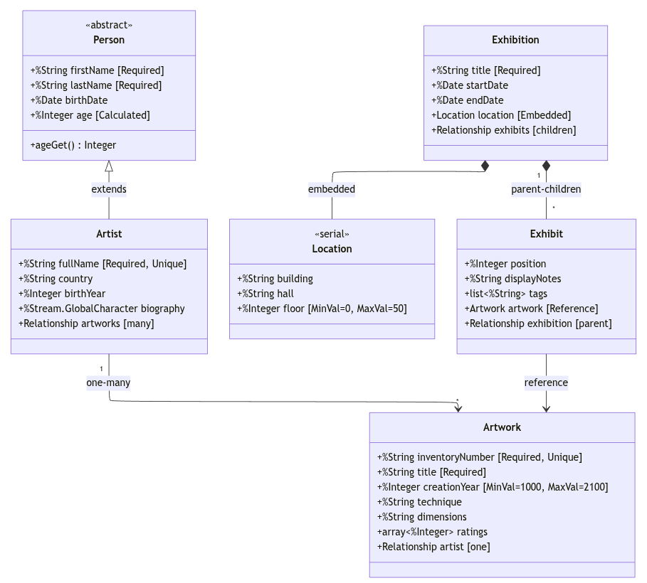

# Лабораторна 3: Діаграма класів

Предметна область: Галерея/Музей

UML-діаграма для реалізації в IRIS описує систему обліку виставок та художніх творів. Центральні сутності — Artist (художник), Artwork (твір мистецтва), Exhibition (виставка) та Exhibit (експонат на виставці).

## Діаграма

## Типи властивостей

**Атомарні** — прості типи даних: firstName, title, inventoryNumber, creationYear.

**Посилання** — зв'язок з іншим persistent-об'єктом. Exhibit.artwork посилається на Artwork; при видаленні Artwork посилання стає порожнім, але Exhibit залишається.

**Вбудований об'єкт** — Location зберігається всередині Exhibition як частина того ж запису. Окремого ID не має, існує лише в контексті батьківського об'єкта.

**Колекція-список** — Exhibit.tags зберігає теги експоната. Порядок елементів зберігається.

**Колекція-масив** — Artwork.ratings з ключами-рядками (джерело оцінки) та значеннями-числами.

**Потік** — Artist.biography для великих текстів, що не вміщуються у звичайну властивість.

**Обчислювана** — Person.age розраховується з birthDate при кожному зверненні.

## Відношення

**Parent-children** — Exhibition → Exhibit. При видаленні виставки всі її експонати видаляються автоматично. Exhibit не може існувати без Exhibition.

**One-many** — Artist ↔ Artwork. Художник має багато творів, твір належить одному художнику. Видалення художника не видаляє твори (на відміну від parent-children).

## Обмеження

- Required: fullName, title, inventoryNumber — обов'язкові для збереження
- Unique: fullName, inventoryNumber — унікальні в межах таблиці
- MinVal/MaxVal: creationYear (1000-2100), floor (0-50) — діапазони значень
